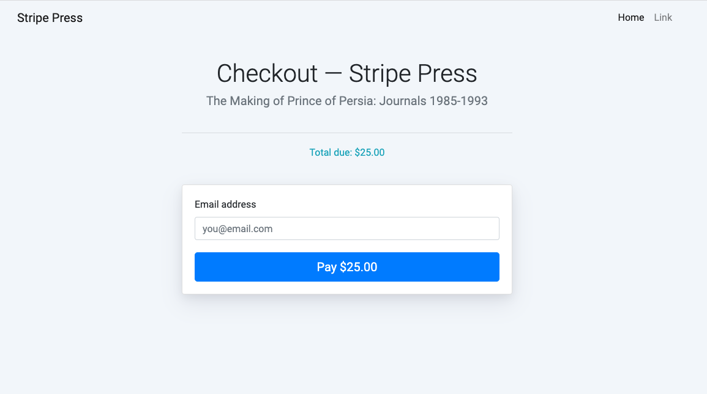
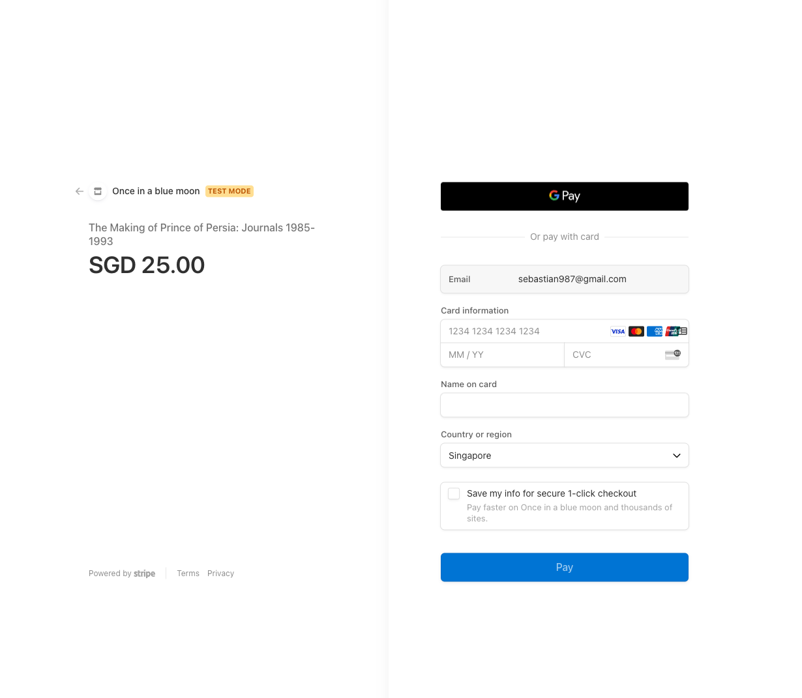
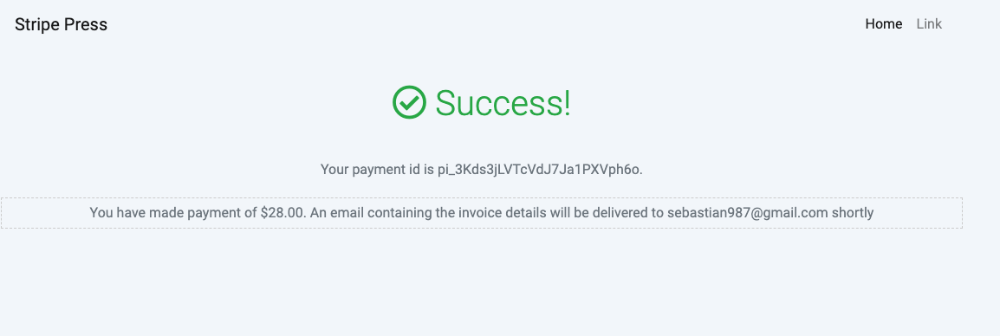

# How to get started

## [Prerequisite] Create product and SKU in Stripe

Initialize the product list with sku, ```npm run createProduct```

References
1. https://stripe.com/docs/api/products/create
2. https://stripe.com/docs/api/sku
3. https://stripe.com/docs/api/idempotent_requests

## Start the application

1. Rename `.env.sample` to `.env` and populate with your Stripe account's test API keys
2. Run server, `npm run start`
3. Navigate to [http://localhost:3000](http://localhost:3000) to view the index page.

# Tenets

## 1. Idempotency
Ensure safe retry without accidentally performing the same operation twice
1. Insert idempotencyKey to Post request
   1. Create product/sku
   2. Create checkout session (via uuid)

## 2. Simple
We favor simplicity and offload complexity
1. Simplify payment
2. Offload inventory management - https://stripe.com/docs/api/skus/object

## 3. Fast
Time is of essence. We look into optimising for speed
1. Cache product metadata - cache it locally

## 4. Secure
Trust little 
1. Do not trust request coming in from user's browser
2. Mask product id
3. Setup session expiry - https://stripe.com/docs/api/checkout/sessions/create#create_checkout_session-expires_at

# How does it work?


| Steps | Customer action                                          | What is done ?                                                                      | Comment                                                                           |
|-------|----------------------------------------------------------|------------------------------------------------------------------------------------|-----------------------------------------------------------------------------------|
| 1     | Customer loads web application                           | Product retrieved from cache                                                       |                                                                                   |
| 2     | Customer clicked on the product they wish to purchase    | ItemId is added to http GET query parameters                                       | Note: item id is the order of the product displayed and is not product id         |
|       |                                                          | Request is redirected to /checkout                                                 |                                                                                   |
| 3     | Customer clicked on "pay" button                         | Attribute {uuid, skuid} is passed to server for processing                         | {uuid} is used as an idempotent key to identify the session and ensure safe retry |
|       |                                                          | Server creates a Stripe checkout session which expires in 60 mins                  |                                                                                   |
|       |                                                          | Stripe checkout session will redirect user back to /success for successful payment |                                                                                   |
| 4     | Customer can view the transaction status and amount paid |                                                                                    |                                                                                   |

References
1. https://stripe.com/docs/api/checkout/sessions/create
2. https://stripe.com/docs/checkout/quickstart
3. https://stripe.com/docs/payments/checkout/custom-success-page
4. https://stripe.com/docs/idempotency

## Challenges encounter?

1. Account name was not setup during signup which prevented any call to create session
2. No email validation done on checkout page
3. Documentation not in sync with SDK 
   1. idempotency_key not used
   2. product attribute, "type" not stated
4. Too much information in documentation making it hard to sieve through the noise
5. Lack of an end to end scenario examples in documentation

## How to extend further?

1. Feature request
   1. Listen to the event triggered - https://stripe.com/docs/webhooks
      1. Enable future product feature request (i.e. display order summary/push app notification/send email)
   2. Integrate with other payment method (i.e. apple pay/google pay)
   3. Handle dispute/refunds - https://stripe.com/docs/file-upload
   4. Shipping rates/tax rates/tax codes/promotion codes - https://stripe.com/docs/api/promotion_codes
   5. Shopping cart
2. App performance
   1. Handle error codes - https://stripe.com/docs/error-codes
   2. Integrate caching strategy 
      1. TTL/force invalidation  
3. Security
   1. Secret key rotation
   2. Integrate with a secure vault (i.e. secret manager)
4. Test
   1. Add tests for happy path (E2E)
   2. Add unit tests

# Demo


# Screenshots

/checkout 



Stripe checkout element



/success


## Payment Success

# FAQ

## Why did we not use price? 

Price is used mainly for product type = service. Each product can have multiple prices. 
However, price does not have keep track if inventory is low. 
For that, we will make use of SKU to ensure we will always be able to fulfil a customer's request

References
1. https://stripe.com/docs/payments/checkout/migrating-prices?integration=client
