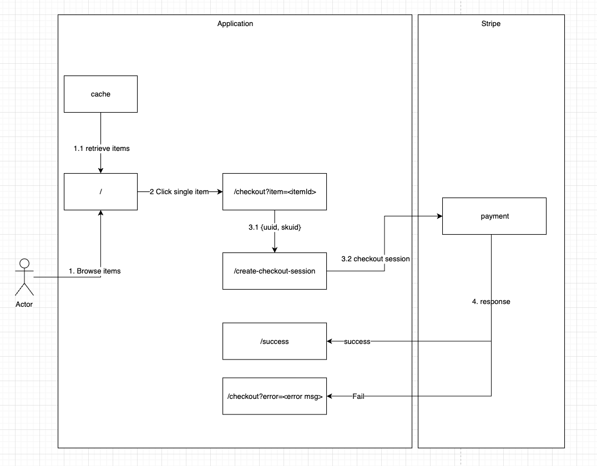

# How to get started

1. To init the product list with sku, `npm run createProduct`
2. Rename `.env.sample` to `.env` and populate with your Stripe account's test API keys
3. Run server, `npm run start`
4. Navigate to [http://localhost:3000](http://localhost:3000) to view the index page.

# Additional information

## Create product and price in stripe

To init the product list with sku

```npm run createProduct```

References
1. https://stripe.com/docs/api/products/create
2. https://stripe.com/docs/api/sku
3. https://stripe.com/docs/api/idempotent_requests

## Tenets

### 1. Idempotency
Ensure safe retry without accidentally performing the same operation twice
1. Insert idempotencyKey to Post request
   1. Create product/sku
   2. Create checkout session (via uuid)

### 2. Simple
We favor simplicity and offload complexity
1. Payment complexity
2. Inventory management - https://stripe.com/docs/api/skus/object
3. Session expiry - https://stripe.com/docs/api/checkout/sessions/create#create_checkout_session-expires_at

### 3. Fast
Time is of essence. We look into optimising for speed
1. Cache product metadata - cache it locally

### 4. Secure
Trust little 
1. Do not trust the integrity of request coming in from user's browser
2. Mask product id (i.e. do not use running number)

## How does it work?
### Pre-setup
1. Create account
2. Create product/skus

### During purchase



1. Customer will click on the product that they wish to purchase (http://localhost:3000/)
   1. retrieve item from cache 
2. Customer will be redirected to the checkout page (http://localhost:3000/checkout?item=1)
   1. Using http get query attribute to pass item id
   2. NOTE: item id != product id
3. Customer will click pay 
   1. attribute, {uuid, skuid} will be passed back to server for processing
   2. a stripe checkout session is created
      1. expiry 60 mins
      2. set uuid idempotent key
      3. retrieve price from cache server
4. Stripe will redirect a customer base on the response

## Challenges encounter?
1. Account name not setup during signup
2. No email validation
3. Documentation outdated
   1. idempotency_key not used
   2. product attribute, "type" not stated

## How to extend further?

1. Feature request
   1. Listen to the event triggered - https://stripe.com/docs/webhooks
      1. Enable future product feature request (i.e. display order summary/push app notification/send email)
   2. Integrate with other payment method (i.e. apple pay/google pay)
   3. Handle dispute/refunds - https://stripe.com/docs/file-upload
   4. Shipping rates/tax rates/tax codes/promotion codes - https://stripe.com/docs/api/promotion_codes
   5. Shopping cart
2. App performance
   1. Handle error codes - https://stripe.com/docs/error-codes
   2Integrate caching strategy 
      1. TTL/force invalidation  
3. Security
   1. Secret key rotation
   2. Integrate with a vault (i.e. secret manager)
4. Test
   1. Add test for happy path (E2E)
   2. Add unit test

## FAQ

### Why did we not use price? 

Price is used mainly for product type = service. Each product can have multiple prices. 
However, price does not have keep track if inventory is low. 
For that, we will make use of SKU to ensure we will always be able to fulfil a customer's request

References
1. https://stripe.com/docs/payments/checkout/migrating-prices?integration=client
